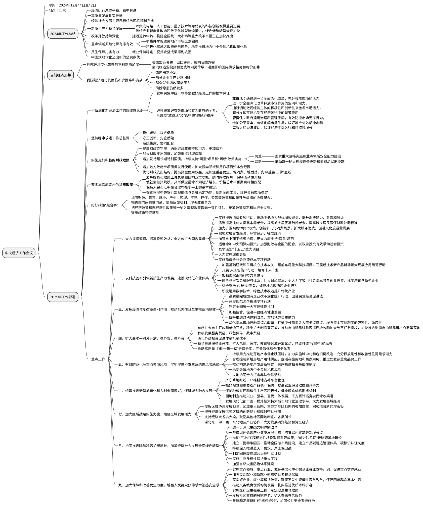

## [2025年中央经济工作会议](https://www.xuexi.cn/lgpage/detail/index.html?id=3995067882095101322)

```plantuml
@startmindmap
+ 中央经济工作会议
++_ 时间：2024年12月11日至12日
++_ 地点：北京
++ 2024年工作总结
+++_ 经济运行总体平稳、稳中有进
+++_ 高质量发展扎实推进
+++_ 经济社会发展主要目标任务即将顺利完成
+++_ 新质生产力稳步发展
++++_ 以集成电路、人工智能、量子技术等为代表的科技创新取得重要进展，\n传统产业智能化改造和数字化转型持续推进，绿色低碳转型步伐加快
+++_ 改革开放持续深化
++++_ 延迟退休年龄、构建全国统一大市场等重大改革举措正在加快推出
+++_ 重点领域风险化解有序有效
++++_ 多措并举促进房地产市场止跌回稳
++++_ 积极化解地方政府债务风险，稳妥推进地方中小金融机构改革化险
+++_ 民生保障扎实有力
++++_ 就业保持稳定，脱贫攻坚成果得到巩固
+++_ 中国式现代化迈出新的坚实步伐
++ 当前经济形势
+++_ 外部环境变化带来的不利影响加深
++++_ 美国加征关税，出口转弱，影响我国外需\n会向制造业投资和消费等内需传导，进而影响国内供求格局和物价形势
+++_ 我国经济运行仍面临不少困难和挑战
++++_ 国内需求不足
++++_ 部分企业生产经营困难
++++_ 群众就业增收面临压力
++++_ 风险隐患仍然较多
++ 2025年工作部署
+++_ 不断深化对经济工作的规律性认识
++++_ 党中央集中统一领导是做好经济工作的根本保证
++++_ 必须统筹好有效市场和有为政府的关系，\n形成既“放得活”又“管得住”的经济秩序
+++++_ **放得活**：通过进一步全面深化改革，充分释放市场的活力\n进一步全面深化改革释放市场作用的空间和潜力，\n通过调动微观经济主体的积极性和创新性来激发市场活力，\n充分发挥市场机制在经济运行中的调节作用
+++++_ **管得住**：政府运用治理和管理手段，有效防控市场无序行为，\n维护公平竞争，有效化解市场失灵，较好地应对外部冲击和\n克服大的经济波动，保证经济平稳运行和可持续增长
+++_ 坚持**稳中求进**工作总基调
++++_ 稳中求进、以进促稳
++++_ 守正创新、先**立**后**破**
++++_ 系统集成、协同配合
+++_ 实施更加积极的**财政政策**
++++_ 提高财政赤字率，确保财政政策持续用力、更加给力
++++_ 加大财政支出强度，加强重点领域保障
++++_ 增加发行超长期特别国债，持续支持“两重”项目和“两新”政策实施
+++++_ 两重
++++++_ 国家**重**大战略实施和**重**点领域安全能力建设
+++++_ 两新
++++++_ 推动**新**一轮大规模设备更新和消费品以旧换**新**
++++_ 增加地方政府专项债券发行使用，扩大投向领域和用作项目资本金范围
++++_ 优化财政支出结构，提高资金使用效益，更加注重惠民生、促消费、增后劲，兜牢基层“三保”底线
+++_ 要实施适度宽松的**货币政策**
++++_ 发挥好货币政策工具总量和结构双重功能，适时降准降息，保持流动性充裕，\n使社会融资规模、货币供应量增长同经济增长、价格总水平预期目标相匹配
++++_ 保持人民币汇率在合理均衡水平上的基本稳定。
++++_ 探索拓展中央银行宏观审慎与金融稳定功能，创新金融工具，维护金融市场稳定
+++_ 打好政策“组合拳”
++++_ 加强财政、货币、就业、产业、区域、贸易、环保、监管等政策和改革开放举措的协调配合，\n完善部门间有效沟通、协商反馈机制，增强政策合力
++++_ 把经济政策和非经济性政策统一纳入宏观政策取向一致性评估，统筹政策制定和执行全过程，\n提高政策整体效能
+++_ 重点工作
++++_ 一、大力提振消费、提高投资效益，全方位扩大国内需求
+++++_ 实施提振消费专项行动，推动中低收入群体增收减负，提升消费能力、意愿和层级
+++++_ 适当提高退休人员基本养老金，提高城乡居民基础养老金，提高城乡居民医保财政补助标准
+++++_ 加力扩围实施“两新”政策，创新多元化消费场景，扩大服务消费，促进文化旅游业发展
+++++_ 积极发展首发经济、冰雪经济、银发经济
+++++_ 加强自上而下组织协调，更大力度支持“两重”项目
+++++_ 适度增加中央预算内投资。加强财政与金融的配合，以政府投资有效带动社会投资
+++++_ 及早谋划“十五五”重大项目
+++++_ 大力实施城市更新
+++++_ 实施降低全社会物流成本专项行动
++++_ 二、以科技创新引领新质生产力发展，建设现代化产业体系
+++++_ 加强基础研究和关键核心技术攻关，超前布局重大科技项目，开展新技术新产品新场景大规模应用示范行动
+++++_ 开展“人工智能+”行动，培育未来产业
+++++_ 加强国家战略科技力量建设
+++++_ 健全多层次金融服务体系，壮大耐心资本，更大力度吸引社会资本参与创业投资，梯度培育创新型企业
+++++_ 综合整治“内卷式”竞争，规范地方政府和企业行为
+++++_ 积极运用数字技术、绿色技术改造提升传统产业
++++_ 三、发挥经济体制改革牵引作用，推动标志性改革举措落地见效
+++++_ 高质量完成国有企业改革深化提升行动，出台民营经济促进法
+++++_ 开展规范涉企执法专项行动
+++++_ 制定全国统一大市场建设指引
+++++_ 加强监管，促进平台经济健康发展
+++++_ 统筹推进财税体制改革，增加地方自主财力
+++++_ 深化资本市场投融资综合改革，打通中长期资金入市卡点堵点，增强资本市场制度的包容性、适应性
++++_ 四、扩大高水平对外开放，稳外贸、稳外资
+++++_ 有序扩大自主开放和单边开放，稳步扩大制度型开放，推动自由贸易试验区提质增效和扩大改革任务授权，加快推进海南自由贸易港核心政策落地
+++++_ 积极发展服务贸易、绿色贸易、数字贸易
+++++_ 深化外商投资促进体制机制改革
+++++_ 稳步推进服务业开放，扩大电信、医疗、教育等领域开放试点，持续打造“投资中国”品牌
+++++_ 推动高质量共建“一带一路”走深走实，完善海外综合服务体系
++++_ 五、有效防范化解重点领域风险，牢牢守住不发生系统性风险底线
+++++_ 持续用力推动房地产市场止跌回稳，加力实施城中村和危旧房改造，充分释放刚性和改善性住房需求潜力
+++++_ 合理控制新增房地产用地供应，盘活存量用地和商办用房，推进处置存量商品房工作
+++++_ 推动构建房地产发展新模式，有序搭建相关基础性制度
+++++_ 稳妥处置地方中小金融机构风险
+++++_ 央地协同合力打击非法金融活动
++++_ 六、统筹推进新型城镇化和乡村全面振兴，促进城乡融合发展
+++++_ 严守耕地红线，严格耕地占补平衡管理
+++++_ 抓好粮食和重要农产品稳产保供，提高农业综合效益和竞争力
+++++_ 保护种粮农民和粮食主产区积极性，健全粮食价格形成机制
+++++_ 因地制宜推动兴业、强县、富民一体发展，千方百计拓宽农民增收渠道
+++++_ 发展现代化都市圈，提升超大特大城市现代化治理水平，大力发展县域经济
++++_ 七、加大区域战略实施力度，增强区域发展活力
+++++_ 发挥区域协调发展战略、区域重大战略、主体功能区战略的叠加效应，积极培育新的增长极
+++++_ 提升经济发展优势区域的创新能力和辐射带动作用
+++++_ 支持经济大省挑大梁，鼓励其他地区因地制宜、各展所长
+++++_ 深化东、中、西、东北地区产业协作，大力发展海洋经济和湾区经济
++++_ 八、协同推进降碳减污扩绿增长，加紧经济社会发展全面绿色转型
+++++_ 进一步深化生态文明体制改革
+++++_ 营造绿色低碳产业健康发展生态，培育绿色建筑等新增长点
+++++_ 推动“三北”工程标志性战役取得重要成果，加快“沙戈荒”新能源基地建设
+++++_ 建立一批零碳园区，推动全国碳市场建设，建立产品碳足迹管理体系、碳标识认证制度
+++++_ 持续深入推进蓝天、碧水、净土保卫战
+++++_ 制定固体废物综合治理行动计划
+++++_ 实施生物多样性保护重大工程
+++++_ 加强自然灾害防治体系建设
++++_ 九、加大保障和改善民生力度，增强人民群众获得感幸福感安全感
+++++_ 实施重点领域、重点行业、城乡基层和中小微企业就业支持计划，促进重点群体就业
+++++_ 加强灵活就业和新就业形态劳动者权益保障
+++++_ 落实好产业、就业等帮扶政策，确保不发生规模性返贫致贫，保障困难群众基本生活
+++++_ 推动义务教育优质均衡发展，扎实推进优质本科扩容
+++++_ 实施医疗卫生强基工程，制定促进生育政策
+++++_ 发展社区支持的居家养老，扩大普惠养老服务
+++++_ 坚持和发展新时代“枫桥经验”，加强公共安全系统施治
@endmindmap
```