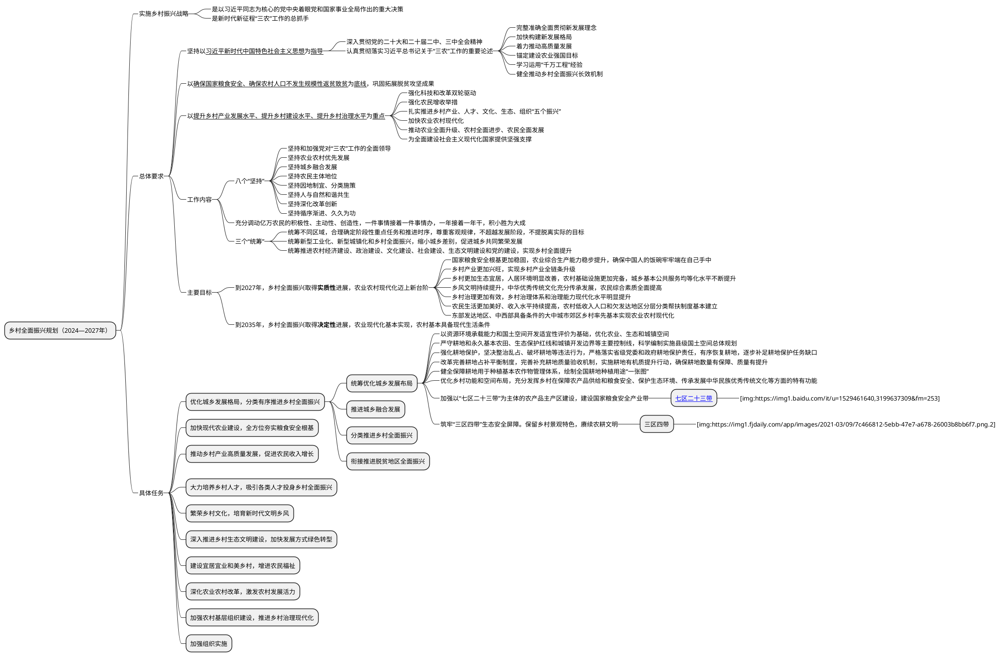

```plantuml
@startmindmap
+ 乡村全面振兴规划（2024—2027年）
++_ 实施乡村振兴战略
+++_ 是以习近平同志为核心的党中央着眼党和国家事业全局作出的重大决策
+++_ 是新时代新征程“三农”工作的总抓手
++_ 总体要求
+++_ 坚持以__习近平新时代中国特色社会主义思想__为__指导__
++++_ 深入贯彻党的二十大和二十届二中、三中全会精神
++++_ 认真贯彻落实习近平总书记关于“三农”工作的重要论述
+++++_ 完整准确全面贯彻新发展理念
+++++_ 加快构建新发展格局
+++++_ 着力推动高质量发展
+++++_ 锚定建设农业强国目标
+++++_ 学习运用“千万工程”经验
+++++_ 健全推动乡村全面振兴长效机制
+++_ 以__确保国家粮食安全、确保农村人口不发生规模性返贫致贫__为__底线__，巩固拓展脱贫攻坚成果
+++_ 以__提升乡村产业发展水平、提升乡村建设水平、提升乡村治理水平__为__重点__
++++_ 强化科技和改革双轮驱动
++++_ 强化农民增收举措
++++_ 扎实推进乡村产业、人才、文化、生态、组织“五个振兴”
++++_ 加快农业农村现代化
++++_ 推动农业全面升级、农村全面进步、农民全面发展
++++_ 为全面建设社会主义现代化国家提供坚强支撑
+++_ 工作内容
++++_ 八个“坚持”
+++++_ 坚持和加强党对“三农”工作的全面领导
+++++_ 坚持农业农村优先发展
+++++_ 坚持城乡融合发展
+++++_ 坚持农民主体地位
+++++_ 坚持因地制宜、分类施策
+++++_ 坚持人与自然和谐共生
+++++_ 坚持深化改革创新
+++++_ 坚持循序渐进、久久为功
++++_ 充分调动亿万农民的积极性、主动性、创造性，一件事情接着一件事情办，一年接着一年干，积小胜为大成
++++_ 三个“统筹”
+++++_ 统筹不同区域，合理确定阶段性重点任务和推进时序，尊重客观规律，不超越发展阶段，不提脱离实际的目标
+++++_ 统筹新型工业化、新型城镇化和乡村全面振兴，缩小城乡差别，促进城乡共同繁荣发展
+++++_ 统筹推进农村经济建设、政治建设、文化建设、社会建设、生态文明建设和党的建设，实现乡村全面提升
+++_ 主要目标
++++_ 到2027年，乡村全面振兴取得**实质性**进展，农业农村现代化迈上新台阶
+++++_ 国家粮食安全根基更加稳固，农业综合生产能力稳步提升，确保中国人的饭碗牢牢端在自己手中
+++++_ 乡村产业更加兴旺，实现乡村产业全链条升级
+++++_ 乡村更加生态宜居，人居环境明显改善，农村基础设施更加完备，城乡基本公共服务均等化水平不断提升
+++++_ 乡风文明持续提升，中华优秀传统文化充分传承发展，农民综合素质全面提高
+++++_ 乡村治理更加有效，乡村治理体系和治理能力现代化水平明显提升
+++++_ 农民生活更加美好、收入水平持续提高，农村低收入人口和欠发达地区分层分类帮扶制度基本建立
+++++_ 东部发达地区、中西部具备条件的大中城市郊区乡村率先基本实现农业农村现代化
++++_ 到2035年，乡村全面振兴取得**决定性**进展，农业现代化基本实现，农村基本具备现代生活条件
++_ 具体任务
+++ 优化城乡发展格局，分类有序推进乡村全面振兴
++++ 统筹优化城乡发展布局
+++++_ 以资源环境承载能力和国土空间开发适宜性评价为基础，优化农业、生态和城镇空间
+++++_ 严守耕地和永久基本农田、生态保护红线和城镇开发边界等主要控制线，科学编制实施县级国土空间总体规划
+++++_ 强化耕地保护，坚决整治乱占、破坏耕地等违法行为，严格落实省级党委和政府耕地保护责任，有序恢复耕地，逐步补足耕地保护任务缺口
+++++_ 改革完善耕地占补平衡制度，完善补充耕地质量验收机制，实施耕地有机质提升行动，确保耕地数量有保障、质量有提升
+++++_ 健全保障耕地用于种植基本农作物管理体系，绘制全国耕地种植用途“一张图”
+++++_ 优化乡村功能和空间布局，充分发挥乡村在保障农产品供给和粮食安全、保护生态环境、传承发展中华民族优秀传统文化等方面的特有功能
+++++_ 加强以“七区二十三带”为主体的农产品主产区建设，建设国家粮食安全产业带
++++++ [[https://baike.baidu.com/item/七区二十三带/6155174 七区二十三带]]
+++++++_ [img:https://img1.baidu.com/it/u=1529461640,3199637309&fm=253]
+++++_ 筑牢“三区四带”生态安全屏障。保留乡村景观特色，赓续农耕文明
++++++ 三区四带
+++++++_ [img:https://img1.fjdaily.com/app/images/2021-03/09/7c466812-5ebb-47e7-a678-26003b8bb6f7.png.2]
++++ 推进城乡融合发展
++++ 分类推进乡村全面振兴
++++ 衔接推进脱贫地区全面振兴
+++ 加快现代农业建设，全方位夯实粮食安全根基
+++ 推动乡村产业高质量发展，促进农民收入增长
+++ 大力培养乡村人才，吸引各类人才投身乡村全面振兴
+++ 繁荣乡村文化，培育新时代文明乡风
+++ 深入推进乡村生态文明建设，加快发展方式绿色转型
+++ 建设宜居宜业和美乡村，增进农民福祉
+++ 深化农业农村改革，激发农村发展活力
+++ 加强农村基层组织建设，推进乡村治理现代化
+++ 加强组织实施
@endmindmap
```
