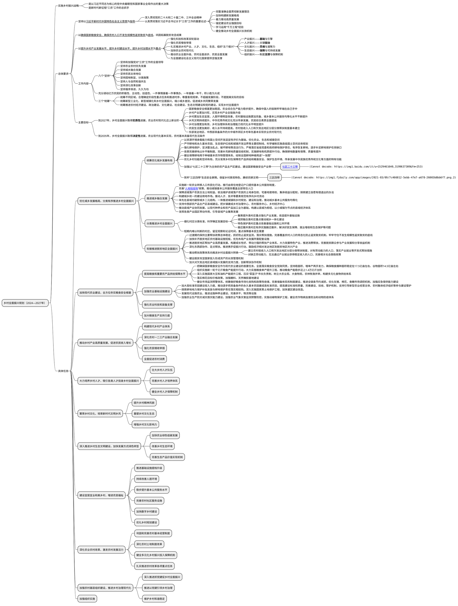

```plantuml
@startmindmap
+ 乡村全面振兴规划（2024—2027年）
++_ 实施乡村振兴战略
+++_ 是以习近平同志为核心的党中央着眼党和国家事业全局作出的重大决策
+++_ 是新时代新征程“三农”工作的总抓手
++_ 总体要求
+++_ 坚持以__习近平新时代中国特色社会主义思想__为__指导__
++++_ 深入贯彻党的二十大和二十届二中、三中全会精神
++++_ 认真贯彻落实习近平总书记关于“三农”工作的重要论述
+++++_ 完整准确全面贯彻新发展理念
+++++_ 加快构建新发展格局
+++++_ 着力推动高质量发展
+++++_ 锚定建设农业强国目标
+++++_ 学习运用“千万工程”经验
+++++_ 健全推动乡村全面振兴长效机制
+++_ 以__确保国家粮食安全、确保农村人口不发生规模性返贫致贫__为__底线__，巩固拓展脱贫攻坚成果
+++_ 以__提升乡村产业发展水平、提升乡村建设水平、提升乡村治理水平__为__重点__
++++_ 强化科技和改革双轮驱动
++++_ 强化农民增收举措
++++_ 扎实推进乡村产业、人才、文化、生态、组织“五个振兴”
+++++_ 产业振兴——**基础**与引擎
+++++_ 人才振兴——关键**驱动**
+++++_ 文化振兴——**灵魂**与凝聚力
+++++_ 生态振兴——**保障**与可持续发展
+++++_ 组织振兴——制度**支撑**与保障机制
++++_ 加快农业农村现代化
++++_ 推动农业全面升级、农村全面进步、农民全面发展
++++_ 为全面建设社会主义现代化国家提供坚强支撑
+++_ 工作内容
++++_ 八个“坚持”
+++++_ 坚持和加强党对“三农”工作的全面领导
+++++_ 坚持农业农村优先发展
+++++_ 坚持城乡融合发展
+++++_ 坚持农民主体地位
+++++_ 坚持因地制宜、分类施策
+++++_ 坚持人与自然和谐共生
+++++_ 坚持深化改革创新
+++++_ 坚持循序渐进、久久为功
++++_ 充分调动亿万农民的积极性、主动性、创造性，一件事情接着一件事情办，一年接着一年干，积小胜为大成
++++_ 三个“统筹”
+++++_ 统筹不同区域，合理确定阶段性重点任务和推进时序，尊重客观规律，不超越发展阶段，不提脱离实际的目标
+++++_ 统筹新型工业化、新型城镇化和乡村全面振兴，缩小城乡差别，促进城乡共同繁荣发展
+++++_ 统筹推进农村经济建设、政治建设、文化建设、社会建设、生态文明建设和党的建设，实现乡村全面提升
+++_ 主要目标
++++_ 到2027年，乡村全面振兴取得**实质性**进展，农业农村现代化迈上新台阶
+++++_ 国家粮食安全根基更加稳固，农业综合生产能力稳步提升，确保中国人的饭碗牢牢端在自己手中
+++++_ 乡村产业更加兴旺，实现乡村产业全链条升级
+++++_ 乡村更加生态宜居，人居环境明显改善，农村基础设施更加完备，城乡基本公共服务均等化水平不断提升
+++++_ 乡风文明持续提升，中华优秀传统文化充分传承发展，农民综合素质全面提高
+++++_ 乡村治理更加有效，乡村治理体系和治理能力现代化水平明显提升
+++++_ 农民生活更加美好、收入水平持续提高，农村低收入人口和欠发达地区分层分类帮扶制度基本建立
+++++_ 东部发达地区、中西部具备条件的大中城市郊区乡村率先基本实现农业农村现代化
++++_ 到2035年，乡村全面振兴取得**决定性**进展，农业现代化基本实现，农村基本具备现代生活条件
++_ 具体任务
+++ 优化城乡发展格局，分类有序推进乡村全面振兴
++++ 统筹优化城乡发展布局
+++++_ 以资源环境承载能力和国土空间开发适宜性评价为基础，优化农业、生态和城镇空间
+++++_ 严守耕地和永久基本农田、生态保护红线和城镇开发边界等主要控制线，科学编制实施县级国土空间总体规划
+++++_ 强化耕地保护，坚决整治乱占、破坏耕地等违法行为，严格落实省级党委和政府耕地保护责任，有序恢复耕地，逐步补足耕地保护任务缺口
+++++_ 改革完善耕地占补平衡制度，完善补充耕地质量验收机制，实施耕地有机质提升行动，确保耕地数量有保障、质量有提升
+++++_ 健全保障耕地用于种植基本农作物管理体系，绘制全国耕地种植用途“一张图”
+++++_ 优化乡村功能和空间布局，充分发挥乡村在保障农产品供给和粮食安全、保护生态环境、传承发展中华民族优秀传统文化等方面的特有功能
+++++_ 加强以“七区二十三带”为主体的农产品主产区建设，建设国家粮食安全产业带
++++++ [[https://baike.baidu.com/item/七区二十三带/6155174 七区二十三带]]
+++++++_ <img:https://img1.baidu.com/it/u=1529461640,3199637309&fm=253>
+++++_ 筑牢“三区四带”生态安全屏障。保留乡村景观特色，赓续农耕文明
++++++ 三区四带
+++++++_ <img:https://img1.fjdaily.com/app/images/2021-03/09/7c466812-5ebb-47e7-a678-26003b8bb6f7.png.2>
++++ 推进城乡融合发展
+++++_ 实施新一轮农业转移人口市民化行动，推行由常住地登记户口提供基本公共服务制度，\n完善“[[https://baike.baidu.com/item/人地钱/19442519 人地钱挂钩]]”政策，推动城镇基本公共服务覆盖全部常住人口
+++++_ 保障进城落户农民合法土地权益，依法维护进城落户农民的土地承包权、宅基地使用权、集体收益分配权，探索建立自愿有偿退出的办法
+++++_ 构建城乡统一的建设用地市场。推动人才、技术等要素规范有序向乡村流动
+++++_ 率先在县域内破除城乡二元结构，一体推进城镇和乡村规划、建设和治理，推动城乡基本公共服务均等化
+++++_ 支持中西部农产品主产区县城建设。把乡镇建成乡村治理中心、农村服务中心、乡村经济中心
+++++_ 推动县域产业协同发展，以现代种养业和农产品加工业为基础，构建以县城为枢纽、以小城镇为节点的县域经济体系
+++++_ 发挥各类产业园区带动作用，引导县域产业集聚发展
++++ 分类推进乡村全面振兴
+++++_ 细化村庄分类标准，科学确定发展目标
++++++_ 集聚提升类村庄重点强化产业发展，改造提升基础设施
++++++_ 城郊融合类村庄重点推动城乡一体化建设
++++++_ 特色保护类村庄重点改善基础设施和公共环境
++++++_ 搬迁撤并类村庄有序实施搬迁撤并，解决好民生保障、就业增收和生态保护等问题
+++++_ 短期内难以判断的村庄，留足观察和论证时间，重点保障基本民生需要
++++ 衔接推进脱贫地区全面振兴
+++++_ 过渡期内保持主要帮扶政策总体稳定，抓好防止返贫监测，落实帮扶措施，完善覆盖农村人口的常态化防止返贫致贫机制，牢牢守住不发生规模性返贫致贫的底线
+++++_ 加快补齐脱贫地区农村基础设施短板，优先布局产业发展所需配套设施
+++++_ 推进脱贫地区帮扶产业高质量发展，构建成长性好、带动力强的帮扶产业体系，大力发展特色产业，推进消费帮扶，完善脱贫群众参与产业发展和分享收益机制
+++++_ 深化东西部协作、定点帮扶。推进携手促振兴行动，鼓励经济相对发达地区到脱贫地区共兴产业
+++++_ 推动帮扶政策体系向推进乡村全面振兴转换
++++++_ 建立农村低收入人口和欠发达地区分层分类帮扶制度，对有劳动能力的人口，落实产业就业等开发式帮扶措施
++++++_ 对缺乏劳动能力、无法通过产业就业获得稳定收入的人口，完善相关社会救助政策
+++++_ 健全脱贫攻坚国家投入形成资产的长效管理机制
+++++_ 加大对欠发达地区县域振兴发展的支持力度，创新帮扶协作机制
+++ 加快现代农业建设，全方位夯实粮食安全根基
++++ 提高粮食和重要农产品供给保障水平
+++++_ 把确保国家粮食安全作为现代农业建设的首要任务，全面落实粮食安全党政同责，坚持稳面积、增单产两手发力，确保粮食播种面积稳定在17.5亿亩左右、谷物面积14.5亿亩左右
+++++_ 组织实施新一轮千亿斤粮食产能提升行动，大力实施粮食单产提升工程，推动粮食产能稳步迈上1.4万亿斤台阶
+++++_ 深入实施国家大豆和油料产能提升工程，压实“菜篮子”市长负责制，树立大农业观、大食物观，农林牧渔并举，构建多元化食物供给体系
+++++_ 落实棉花目标价格政策，加强糖料、天然橡胶基地建设
+++++_ 健全市场监测预警体系，统筹做好粮食市场化收购和政策性收储，完善储备体系和制度建设，推进全链条节约减损，优化生猪、棉花、食糖市场调控机制，加强应急保供能力建设
++++ 加强农业基础设施建设
+++++_ 加大高标准农田建设投入力度，推动逐步把具备条件的永久基本农田建成高标准农田，提高建设标准和质量，完善建设、验收、管护机制，支持引导新型农业经营主体、农村集体经济组织等参与建设管护
+++++_ 探索耕地地力保护补贴发放与耕地保护责任落实相挂钩。深入实施国家黑土地保护工程，加快灌区建设改造。
+++++_ 发展现代设施农业，推进设施种养业建设，完善烘干、物流等设施
+++++_ 加强农业生产防灾减灾救灾能力建设，加强农业气象灾害监测预警防控，实施动植物保护工程，健全农作物病虫害防治和动物防疫体系
++++ 强化农业科技和装备支撑
++++ 加大粮食生产支持力度
+++ 推动乡村产业高质量发展，促进农民收入增长
++++ 构建现代乡村产业体系
++++ 深化农村一二三产业融合发展
++++ 强化农民增收举措
++++ 全面促进农村消费
+++ 大力培养乡村人才，吸引各类人才投身乡村全面振兴
++++ 壮大乡村人才队伍
++++ 完善乡村人才培养体系
++++ 健全乡村人才保障机制
+++ 繁荣乡村文化，培育新时代文明乡风
++++ 提升乡村精神风貌
++++ 重塑乡村文化生态
++++ 增强乡村文化影响力
+++ 深入推进乡村生态文明建设，加快发展方式绿色转型
++++ 加快农业绿色低碳发展
++++ 改善乡村生态环境
++++ 完善生态产品价值实现机制
+++ 建设宜居宜业和美乡村，增进农民福祉
++++ 推进基础设施提档升级
++++ 持续改善人居环境
++++ 稳步提升基本公共服务水平
++++ 完善农村社区服务设施
++++ 加快数字乡村建设
++++ 优化乡村规划建设
+++ 深化农业农村改革，激发农村发展活力
++++ 巩固和完善农村基本经营制度
++++ 深化农村土地制度改革
++++ 健全多元化乡村振兴投入保障机制
++++ 扎实推进农村改革各项重点任务
+++ 加强农村基层组织建设，推进乡村治理现代化
++++ 深入推进抓党建促乡村全面振兴
++++ 推进以党建引领乡村治理
++++ 维护乡村和谐稳定
+++ 加强组织实施
@endmindmap
```
